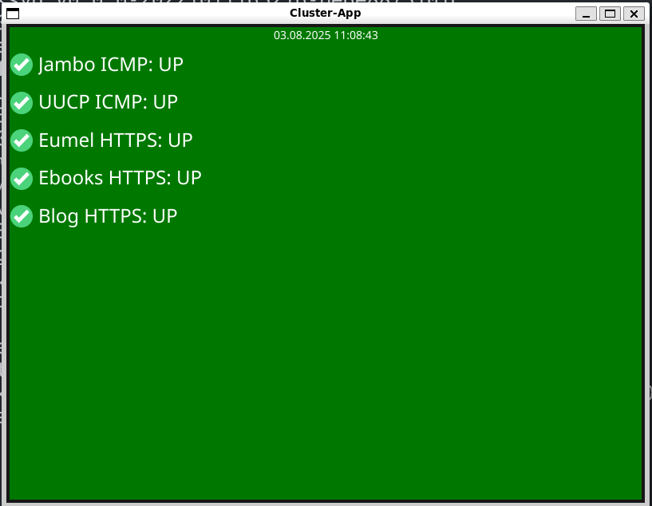
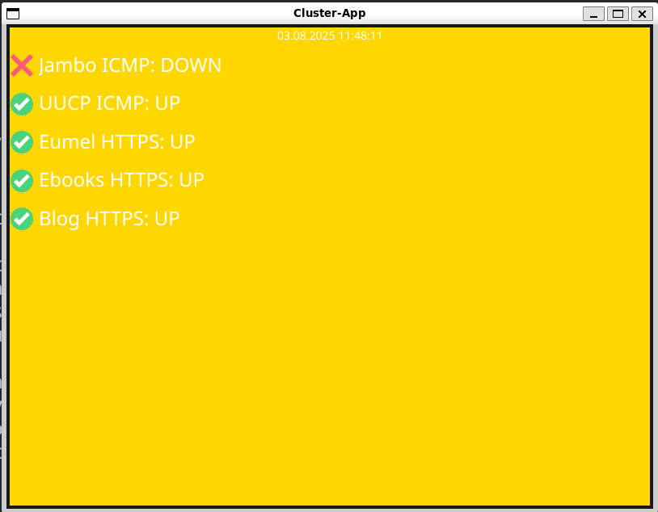

# cluster-app

a small program to run on your Linux desktop or WSL to observe the status from your very important services.
metrics are fetched from your existing Prometheus backend and displayed on the cluster-app window.





configure your relevant metrics in [metrics.json](metrics.json), download the binary from the [Release page](https://github.com/eumel8/cluster-app/releases) and start the program in the same directory where the metric.json exists.

point `PROMETHEUS_URL` env to your Prometheus backend, i.e. 

```
export PROMETHEUS_URL=http://prometheus.example.com:9090
```

optional set `PULL_DURATION` to another value in seconds to pull new metrics (default: 60), i.e.

```
export PULL_DURATION=10
```

start the program and enjoy

## Vulkan driver in WSL (optional)

```
sudo apt install vulkan-tools
```

## Prometheus Auth

If you protect your Prometheus endpoint with authentication, you can set env var for username and password:

```
export PROM_USER=xxxx
export PROM_PASS=xxxx
```

## Bitwarden feature

Start the programm with `-bw` or set env var

```
export CLUSTERCHECK_BW=1
```

In this version the programm expect an item on a Bitwarden service containing username/password for HTTP Basic Auth on
Prometheus API

```
bw get item "Prometheus Agent RemoteWrite
```

## Tips & Tricks

### no GPU support in WSL

```
export LIBGL_ALWAYS_SOFTWARE=1
```

### Prometheus TLS connection

we skip SSL verification and allow insecure connection by default, take care.

### Proxy Settings

we respect env vars like `http_proxy` or `https_proxy` for Prometheus endpoint connection from your computer.


